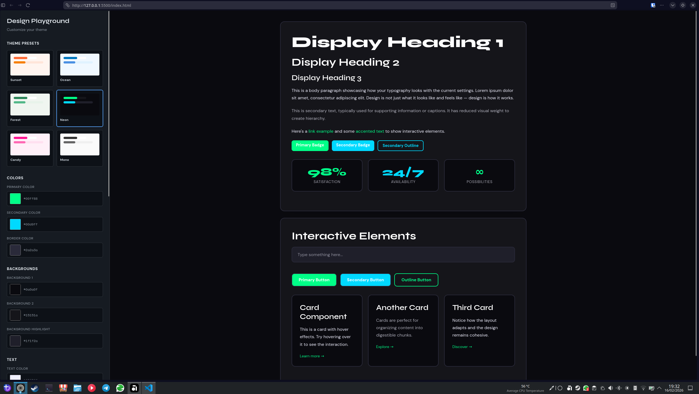

# Theme Tester

An interactive tool to test and export design system variables in real-time.

## Features

- 🎨 **Color System** - Primary, secondary, backgrounds, text, and borders
- ✍️ **Typography** - Font selection and sizing
- 🎭 **Theme Presets** - 6 built-in themes + custom theme saving
- 🔧 **Styling Controls** - Border radius, size, and shadows
- 📋 **CSS Export** - Copy ready-to-use CSS variables

## What You Can Control

**Colors:**
- Primary & Secondary colors
- 3 background levels
- Text and title colors
- Border color

**Typography:**
- Body font
- Heading font  
- Font size (12-24px)

**Effects:**
- Border radius (0-32px)
- Border thickness (0-8px)
- Shadow intensity

## Tech

Pure HTML/CSS/JavaScript - no dependencies required.

 Access [here](https://rafaelkc.github.io/theme-tester/).
